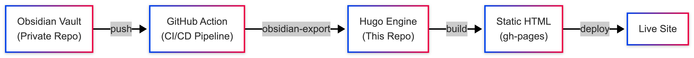
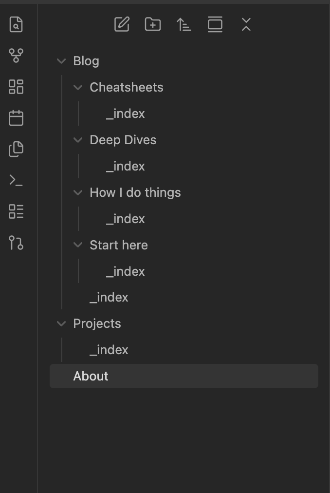

# Portfolio Engine 🚀

A minimal, "Headless" Static Site Generator for Obsidian users.

> **Template:** Fork this repository to create your own Portfolio.

This repository acts as the Engine. It contains the code, theme, and build pipeline. It is designed to be empty of content on purpose. It pulls its content from a separate, Private GitHub Repository (your Obsidian Vault) during the build process.

## 🛠 Prerequisites

- Hugo: v0.146.0+ (Extended Edition)
- Git
- Obsidian (for content creation)

## Architecture

The platform follows a Headless CMS pattern using Git as the single source of truth.



- **Secure:** Your raw notes stay private. Only files marked `publish: true` are built.
- **Automated:** Write in Obsidian -> Push -> Live Site updates in 60s.
- **Decoupled:** You can swap this engine/theme without touching your notes.

## Components

- **Engine:** Hugo (Static Site Generator).
- **Theme:** [PaperMod](https://github.com/adityatelange/hugo-PaperMod) — **Adapted & Customized:** This engine uses a modified version of the PaperMod theme, specifically styled and configured to serve as a seamless, minimalist frontend for Obsidian content.
- **Content:** Private Obsidian Markdown files.
- **Pipeline:** GitHub Actions to pick events from the private repository and trigger deployment.
- **Hosting:** GitHub Pages.

## 🚀 How to Use

**Do not clone this directly.** Instead, follow these steps to make it your own.

### Step 1: Fork the Engine

- Click the **Fork** button (top right of this page) to create a copy under your own GitHub account.
- Go to your new repository's **Settings -> Pages**.
- Source: **GitHub Actions** (or Deploy from a branch -> `gh-pages` depending on your setup).
- **Important:** Delete the `public/` folder if it exists in your fork, as this contains the previous user's build artifacts.

### Step 2: Create Your Content Vault

- Create a new, empty **Private Repository** on GitHub (e.g., `my-obsidian-vault`).
- In Obsidian, create the following folder structure to match the Engine's configuration:



### Step 3: Connect The Public and Private Repos

- Create a [Personal Access Token (Classic)](https://github.com/settings/tokens) with `repo` scope.
- **In your Forked Engine Repo:** Go to **Settings -> Secrets and variables -> Actions -> New Repository Secret**.
  - Name: `PAT_TOKEN`
  - Value: (Paste your token)
- **In your Private Content Repo:** Repeat the step above to add the same `PAT_TOKEN`.

### Step 4: Configure the Private Repo Trigger

In your **Private Content Repository** (the Obsidian vault), you need a workflow that notifies this Engine whenever you push new notes.

1. In your private repo, create a file at `.github/workflows/trigger-site-build.yml`.
2. Paste the following code:

```yaml
name: Trigger Portfolio Build

on:
  push:
    branches: [main]

jobs:
  trigger:
    runs-on: ubuntu-latest
    steps:
      - name: Trigger event to engine
        uses: peter-evans/repository-dispatch@v2
        with:
          token: ${{ secrets.PAT_TOKEN }}
          repository: YOUR_USERNAME/YOUR_FORKED_ENGINE_REPO # <--- UPDATE THIS
          event-type: publish-event
```

### Step 5: Configure the Engine Pipeline

- Open `.github/workflows/sync-and-deploy.yml` in your forked Engine repository.

- Update the repository: field to point to your Private Content Repo.

```yaml
# Inside .github/workflows/sync-and-deploy.yml
- name: Checkout Content (Your Private Obsidian Vault)
  uses: actions/checkout@v3
  with:
    repository: YOUR_USERNAME/YOUR_PRIVATE_VAULT # <--- UPDATE THIS
    token: ${{ secrets.PAT_TOKEN }}
```

## ⚙️ Configuration (hugo.toml)

You must update the configuration file to match your details, or the site will break.

- Open hugo.toml and change: baseURL = "[Link your repo](https://YOUR-USERNAME.github.io/YOUR-REPO-NAME/)"

- Profile, Name & Logo:

```toml
title = "Your Name"
[params.label]
    icon = "logo.png" # Upload your own logo to /static/ folder and remove 'logoT.jpg'

```

- Profile Mode: Update the title and subtitle in [params.profileMode] to reflect your own bio.

- Menu Links: Adjust the [[menu.main]] section if you changed folder names in Obsidian.

## 📝 Writing & Publishing

1. Write normally in Obsidian

2. Publish a specific note by adding this to the top of the file:

```yaml
---
title: "My Note Title"
publish: true
---
```

## 🎨 Customization

- Theme Config: Adapted the [PaperMod](https://github.com/adityatelange/hugo-PaperMod) a little per my preferences.

- Images: Place images in static/ (e.g., your favicon or logo).

- Styling: assets/css/custom.css (Overrides for typography and layout).

- Layouts: layouts/ (HTML structure overrides).

## 🎨 Contributing

Contributions are welcome! If you have ideas for improvements, new features, or bug fixes, please feel free to:

1. Open an Issue to discuss the change.

2. Submit a Pull Request with your updates.

## 🎨 Usage

This project is free to use. You are welcome to fork, modify, and use this engine for your own personal portfolio or project without restriction.

"Portfolio Engine created by [NewerKey](https://github.com/NewerKey)
